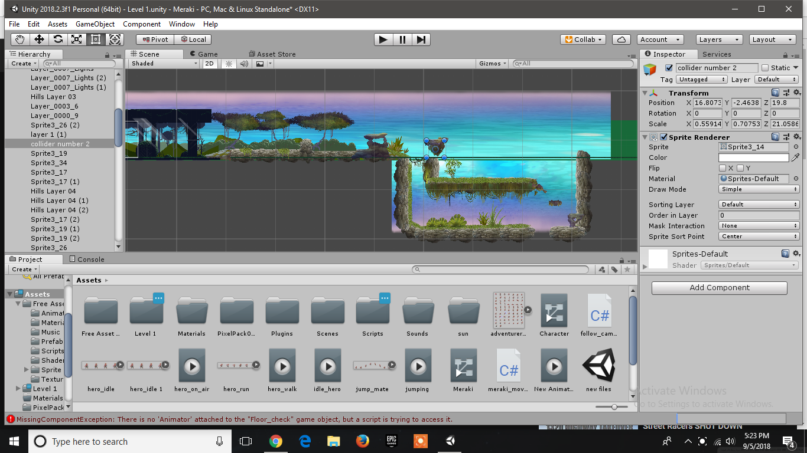
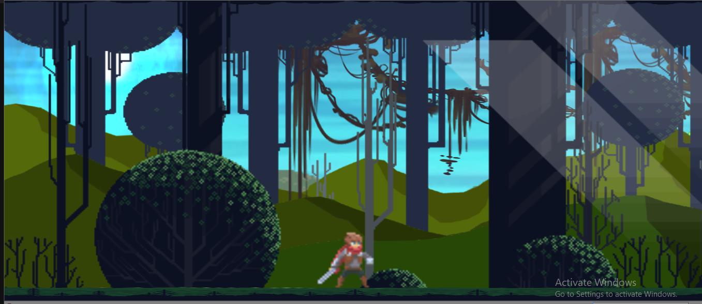
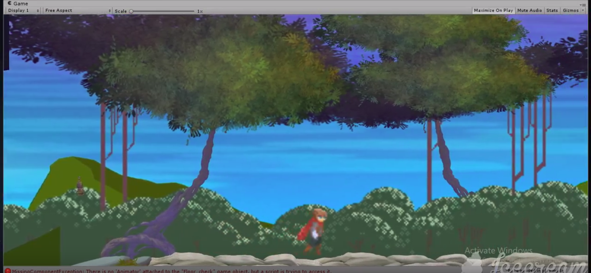
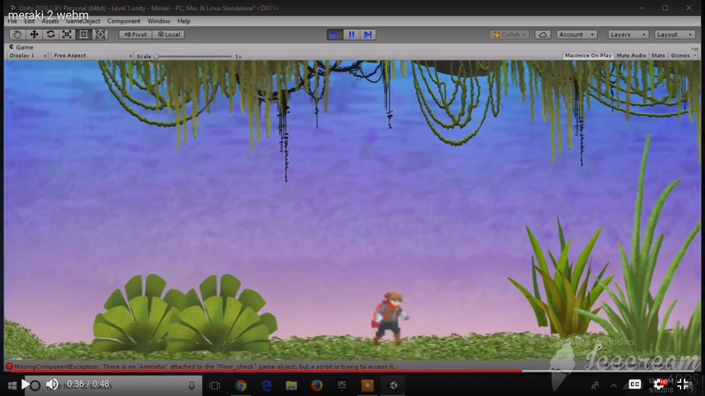

# DESCRIPTION

**Meraki** is a **2D role playing game** named after the character Meraki.

A role-playing game is a game in which players ***assume the roles of characters in a fictional setting***. 

***The game helps interface with graphics and have fun as you appreciate **Meraki's personality** regardless of the dangers and risks that define him***.

# PROBLEM STATEMENT

People these days don’t appreciate themselves for who they are...the reasons to this are many it can be:

* Low self-esteem.

* Insecure about opinions.

# SOLUTION

We thought to solve that problem by showing you the story of Meraki who appreciates his personality regardless of what others think you’ll see how he took risks and encountered dangers to maintain that because that what defines him.

# DISPLAY



---



---



--



---

## AUTHORS.
**Credits**

* Steve Wachira.

* Neville Kaundu.

* Collins Kariuki.

* Ben Karanja.


# Prerequisites.

To work with the game you have to clone Meraki on my github repo to access the game. 

Link:->  ```https://github.com/zecollokaris/Meraki```
    

* You Will Need to have **Microsoft Window** installed on your device.

    -Microsoft Windows is a group of several ***graphical operating system*** families, all of which are developed, marketed, and sold by Microsoft.

    -This is because the game engine is currently available on Microsoft Windows.


*  You need to install **Unity game engine**

    -Unity is, in short, a closed-source, cross-platform game development application. You create your game by manipulating objects in 3D and attaching various components to them. Even 2D games must be manipulated in 2D/3D. Scripts are written in C# (recommended), Boo or UnityScript.

# TECHNOLOGIES USED.

1. **Unity Game Engine.**

    -This is the engine used to create the scripts that held the game together including the game physics of the game such as gravity.

2. **Adobe Photoshop.**

    -Used to design character animations and style the character.

3. **Adobe Illustrator.**

    -Used to design game environment especially how the nature around was postioned.

4. **C Sharp (programming language).**

    -C# is a multi-paradigm programming language encompassing strong typing, imperative, declarative, functional, generic, object-oriented (class-based), and component-oriented programming disciplines.

    -This is because Unity recommends scripts to be written in C#.

# Support and Contact

-Email Address: 

collo.kariss@gmail.com,

BenKaranja43@gmail.com, 

stevewachiradev@gmail.com

kilonzoneville@gmail.com

# License

The app is licensed by MIT.

Meraki - MIT (c) 2018 LICENSE

---